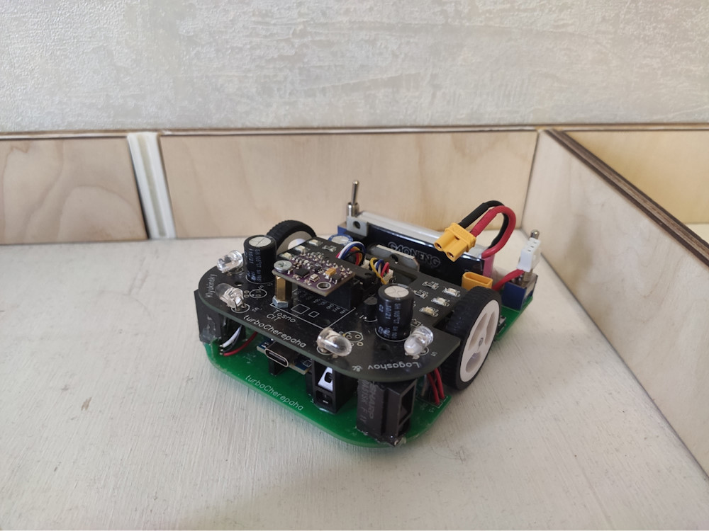

# turbo_cherepaha
Repository for maze solving robot

Доступно несколько режимов:
- поиск короткого пути с плаными поворотами 
- поиск короткого пути с плаными поворотами с записью в память
- быстрый заезд по короткому пути с загрузкой из памяти
- включение моторов для тестирования

Также присутсвтуют вспомогательные скрипты для тестированя функциональности робота

